## 6. Interface do sistema

O sistema PedaLa é composto por uma página institucional (landing page) e três áreas autenticadas, segmentadas por perfil de usuário: **Cliente** (locatário das bicicletas), 
**Funcionário** (operação de campo: vistorias, entregas e rastreamento) e 
**Administrador** (gestão completa do negócio). 

A navegação dentro de cada painel ocorre por seções (sem recarregar a página), acessadas pelo menu lateral.

## 6.1. Tela principal do sistema

A tela principal é a landing page pública do PedaLa, acessível a qualquer visitante. Ela apresenta a proposta de valor do serviço de assinatura de bicicletas (manutenção inclusa, entrega em domicílio e suporte via GPS), destaca o plano em oferta e indicadores de confiança (modelos disponíveis, cidades atendidas, percentual de satisfação). A partir dela o usuário acessa o login, o cadastro ou navega pelo catálogo de bicicletas.

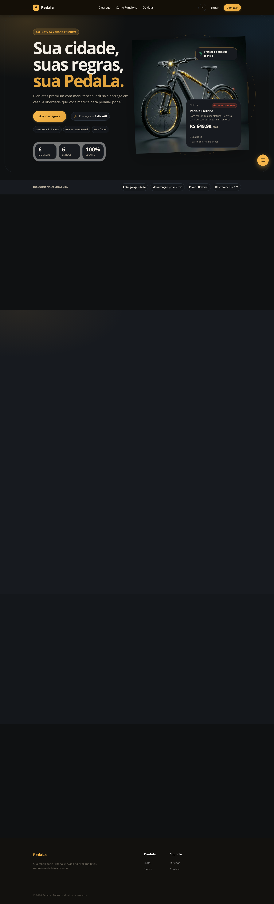

## 6.2. Telas do processo 1 — Gestão do Cliente

_Descrição da tela relativa à atividade 1._

**Login** — tela de autenticação do cliente. O usuário informa e-mail e senha cadastrados para acessar sua conta; também é possível navegar para a tela de cadastro a partir do link "Cadastre-se".

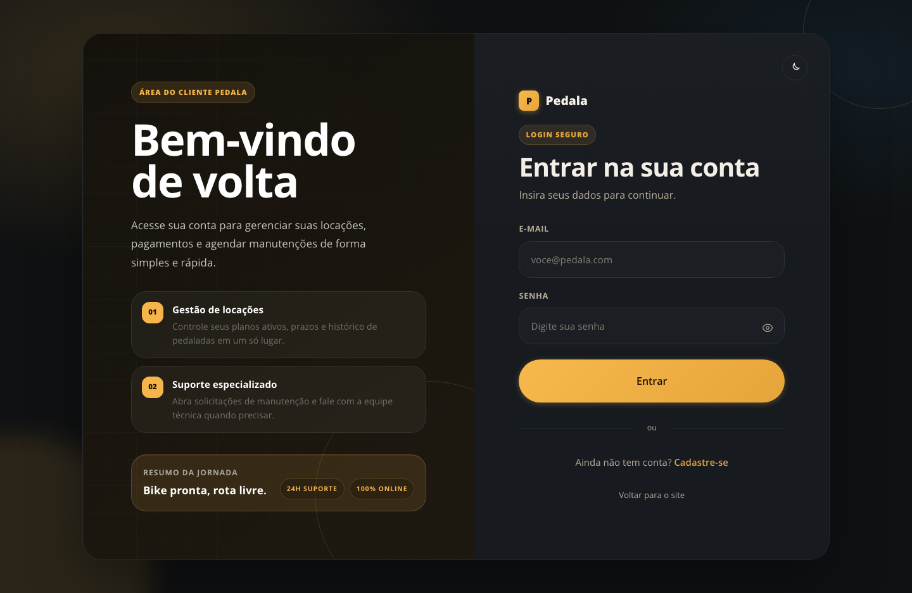

_Descrição da tela relativa à atividade 2._

**Cadastro** — tela de criação de conta, onde o novo cliente informa nome, CPF, e-mail, telefone e senha para gerar seu acesso ao sistema.

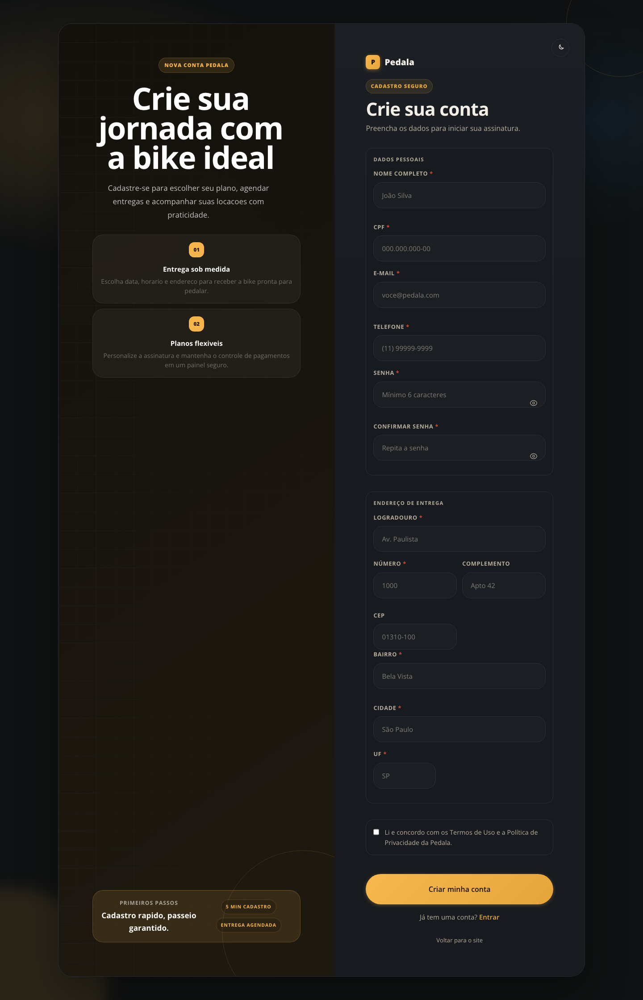

**Dashboard do Cliente** — tela inicial após o login, com visão geral das bicicletas disponíveis, total de locações realizadas e contratos ativos do usuário, além de acesso rápido ao catálogo.

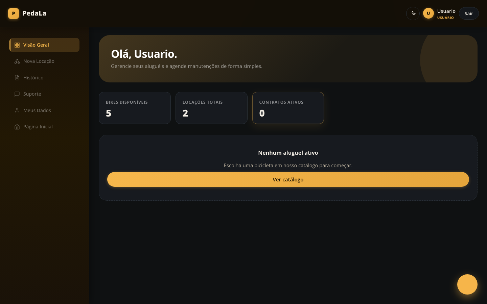

## 6.3. Telas do processo 2 — Cadastro e Reserva de Bicicleta

_Descrição da tela relativa à atividade 1._

**Nova Locação (catálogo)** — tela em que o cliente visualiza os modelos de bicicleta disponíveis (urbana, mountain bike, dobrável, elétrica, infantil), com preços por plano (semanal, quinzenal, mensal) e botão para efetivar o aluguel.

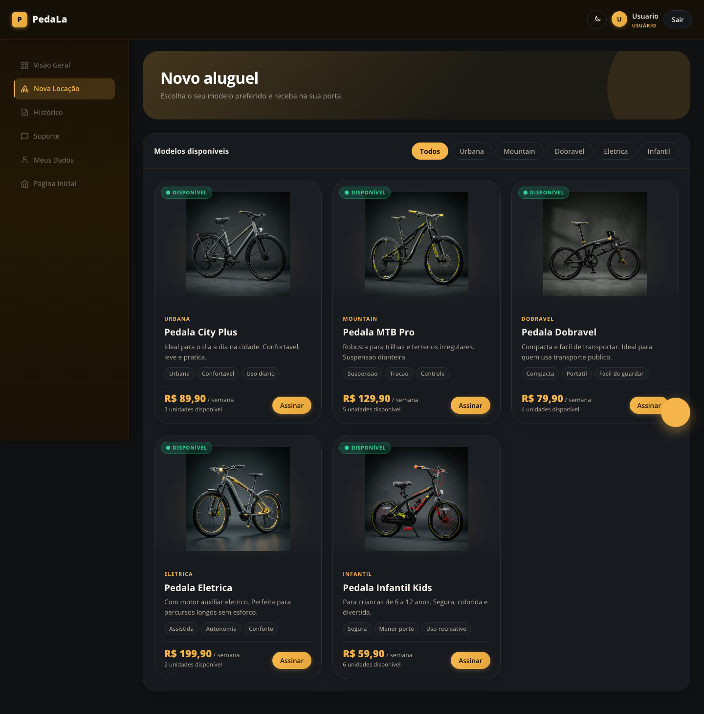

_Descrição da tela relativa à atividade 2._

**Histórico de Locações** — tela onde o cliente acompanha os aluguéis ativos e finalizados, com plano contratado, data de início, devolução prevista, valor atual, seguro e acesso ao contrato.

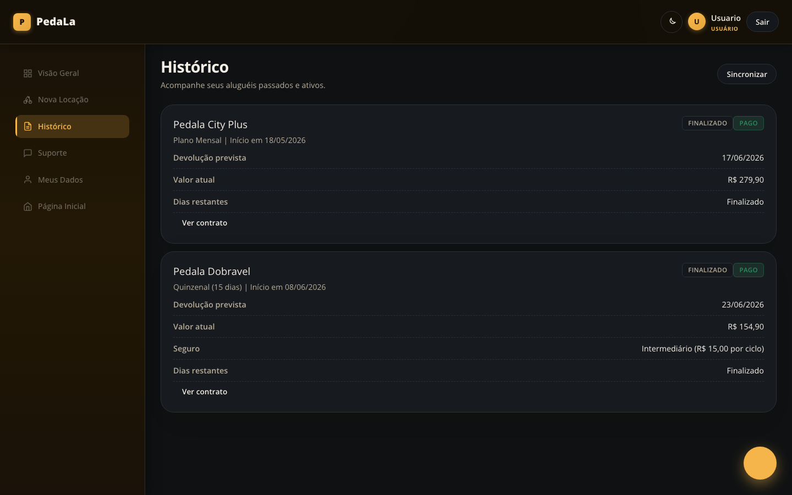

## 6.4. Telas do processo 3 — Operação do Funcionário

**Painel do Funcionário** — tela de resumo das pendências operacionais do dia: vistorias pendentes, entregas pendentes e chamados abertos.

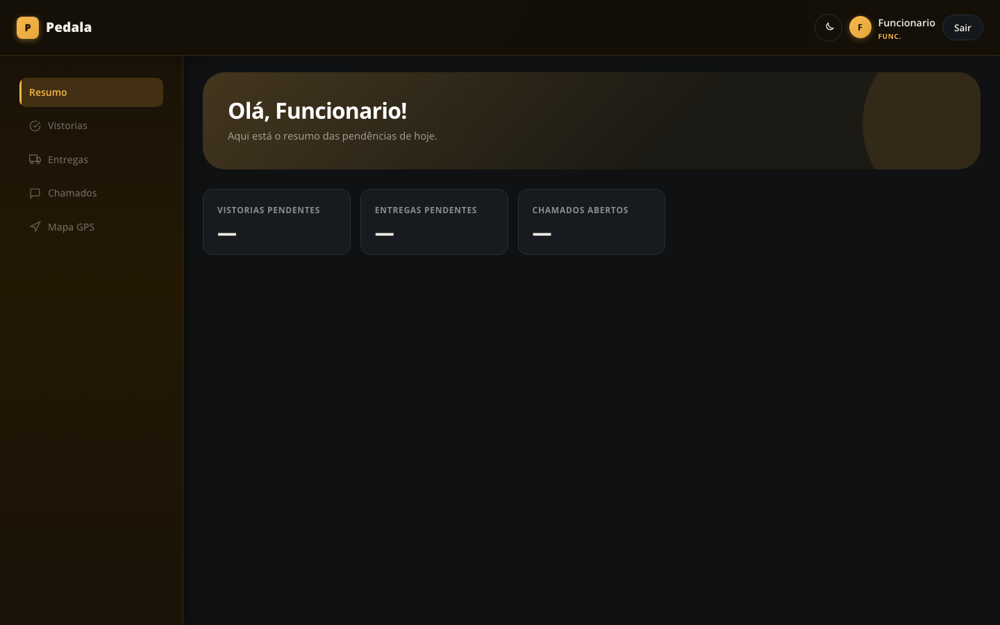

**Entregas** — tela em que o funcionário confirma a entrega da bicicleta ao cliente após a criação de uma locação.

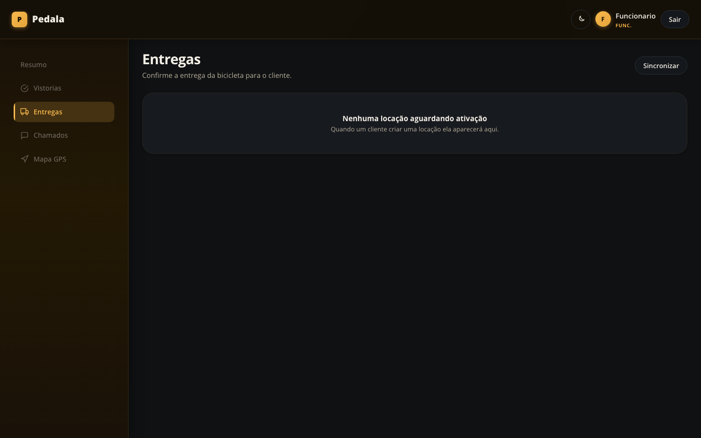

**Mapa GPS (funcionário)** — tela de rastreamento em tempo real das bicicletas em locação ativa, com atualização periódica de posição no mapa e lista das bikes em circulação.

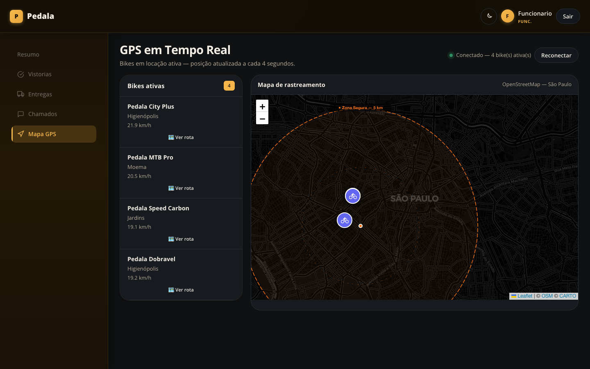

## 6.5. Telas do processo 4 e 5 — Pagamento, Gestão e Monitoramento (Administrador)

**Dashboard do Administrador** — visão geral do negócio: bicicletas ativas, disponíveis, locações em andamento, locações em atraso, contratos pendentes e faturamento do mês, além do status da frota e dos chamados de suporte.

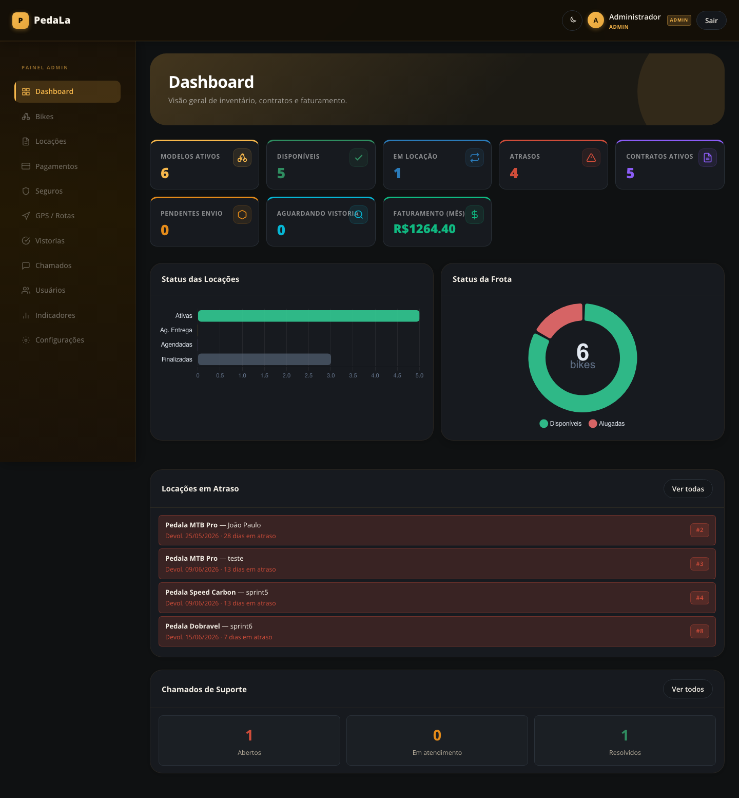

**Gestão de Bikes** — tela para cadastro de novas bicicletas (nome, categoria, quantidade, descrição e preços por plano) e gerenciamento da frota cadastrada.

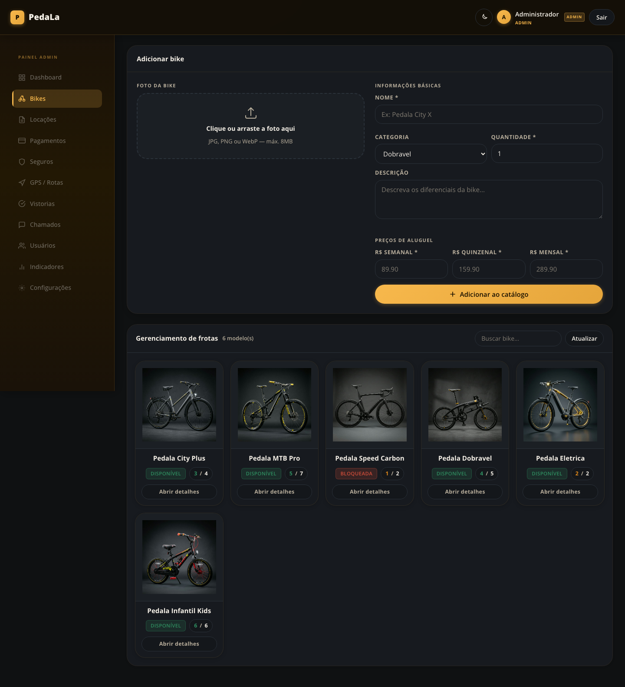

**Locações** — tela de acompanhamento de todas as locações do sistema, com filtros por status, identificação de cliente, bike, plano, datas e situação do pagamento.

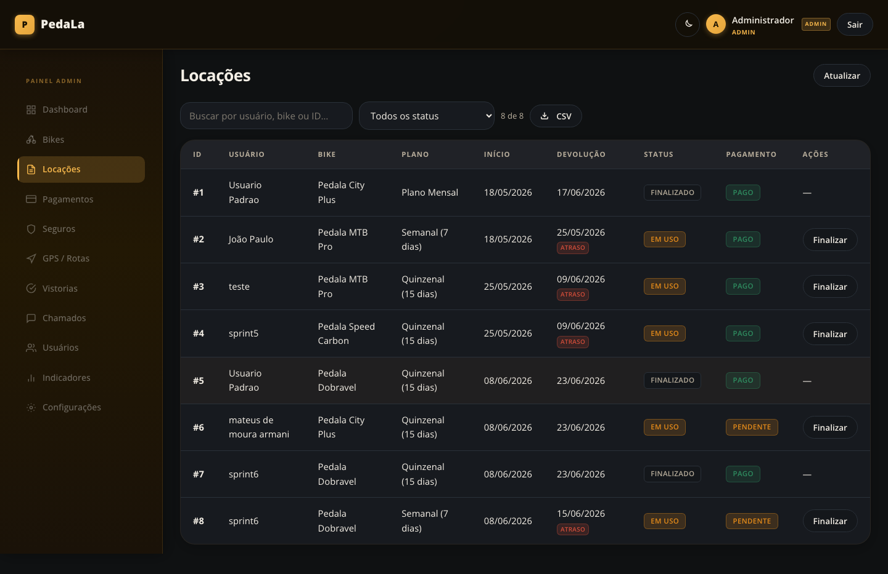

**Pagamentos** — tela de aprovação das faturas geradas pelas locações, exibindo valor, vencimento e permitindo aprovar faturas pendentes.

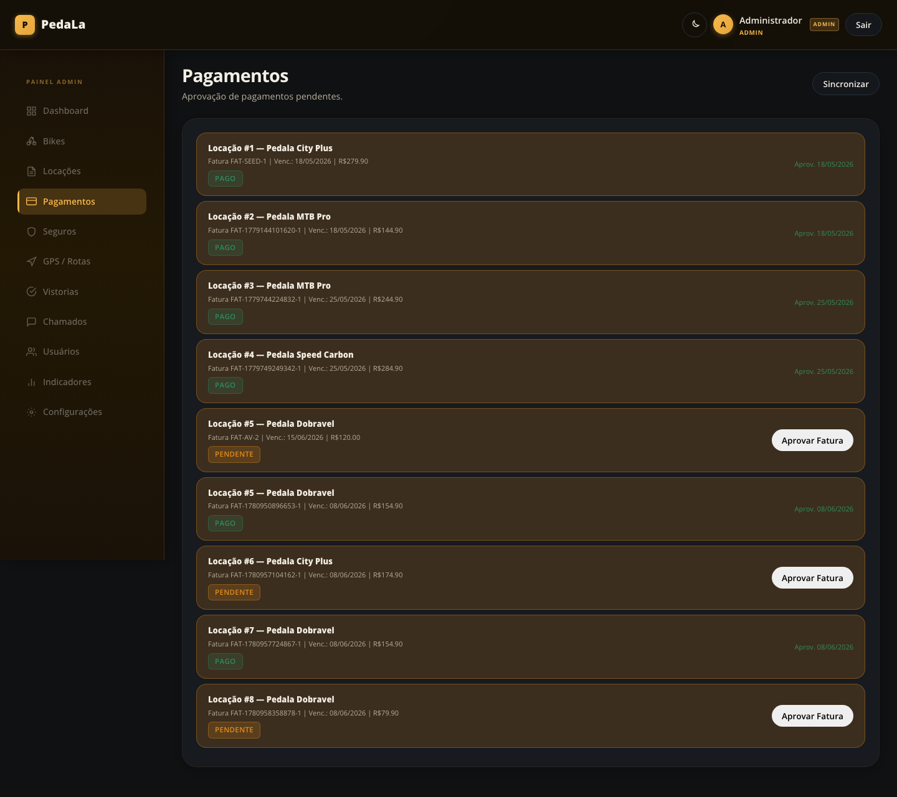

**GPS / Rotas (administrador)** — tela de monitoramento e encerramento de locação, com mapa de rastreamento em tempo real de todas as bikes ativas na frota.

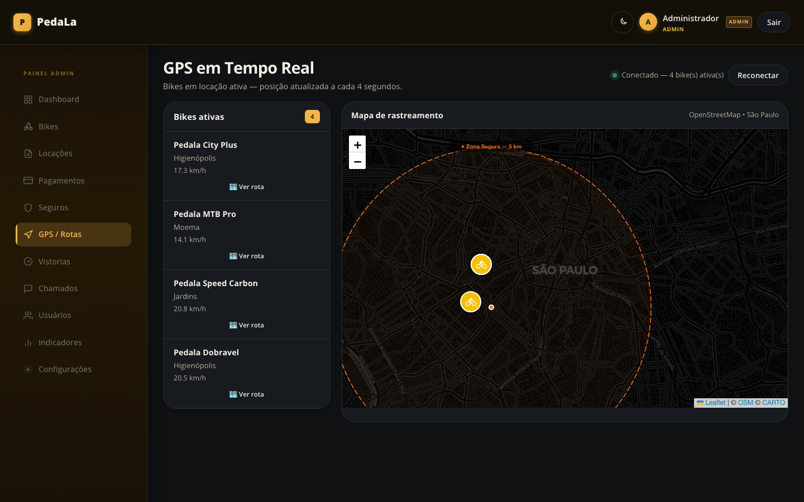

**Indicadores de Desempenho** — tela com os KPIs operacionais do negócio: taxa de ocupação mensal, taxa de renovação de aluguel e tempo médio de entrega, com gráfico de tendência dos últimos 6 meses.

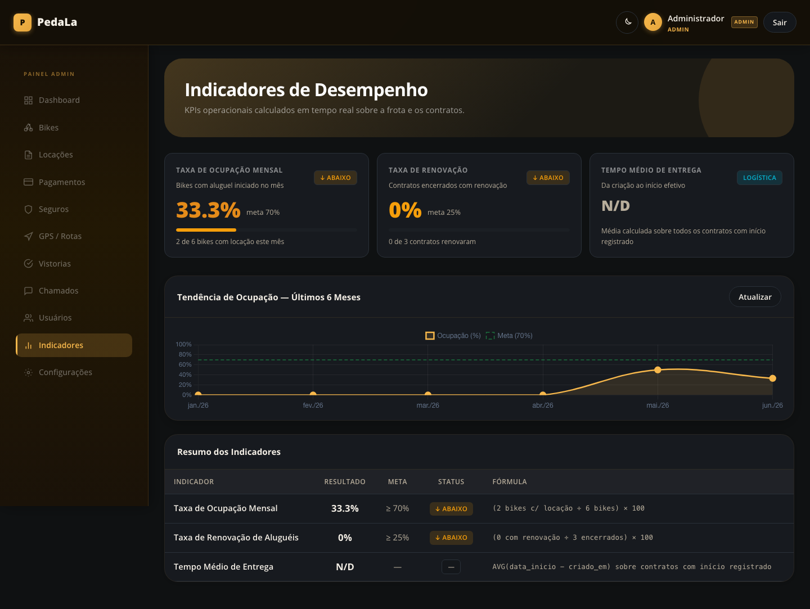
