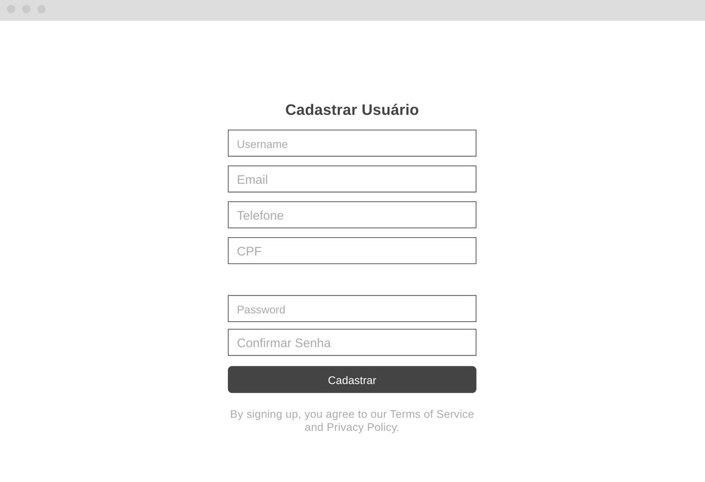
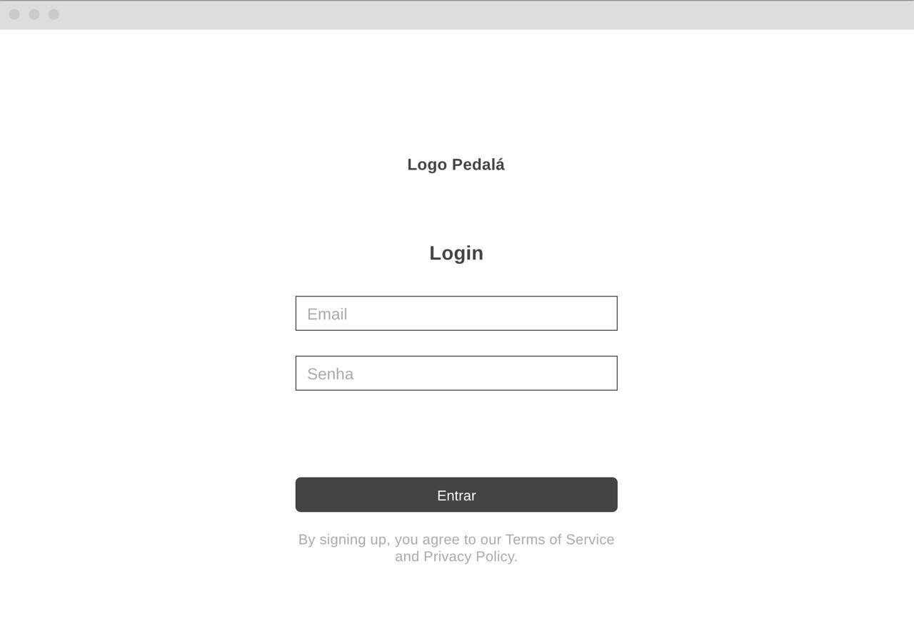

### 3.3.1 Processo 1 – Gestão do Cliente

Uma melhoria importante seria a implementação de validação automática em tempo real dos dados inseridos, reduzindo erros no preenchimento. Além disso, a inclusão de autenticação em duas etapas aumentaria a segurança do acesso do usuário.

#### Detalhamento das atividades

O processo 1 contempla o acesso inicial do cliente, autenticação, criação de conta,
consulta de perfil e atualização dos dados cadastrais. As atividades abaixo
descrevem os campos, regras e comandos necessários para que o usuário consiga
entrar no sistema e manter suas informações atualizadas.

**Acessar Home**

| **Campo** | **Tipo** | **Restrições** | **Valor default** |
| --- | --- | --- | --- |
| N/A | N/A | N/A | N/A |

| **Comandos** | **Destino** | **Tipo** |
| --- | --- | --- |
| Fazer Login | Efetuar Login | default |
| Criar Conta | Preencher dados de cadastro | link/botão |

**Efetuar Login**

| **Campo** | **Tipo** | **Restrições** | **Valor default** |
| --- | --- | --- | --- |
| Email | Caixa de texto | Obrigatório, formato de e-mail | |
| Senha | Caixa de texto | Obrigatório | |

| **Comandos** | **Destino** | **Tipo** |
| --- | --- | --- |
| entrar | Gateway: Informações Atualizadas? | default |
| cancelar | Acessar Home | cancel |

**Preencher dados de cadastro**

| **Campo** | **Tipo** | **Restrições** | **Valor default** |
| --- | --- | --- | --- |
| Nome | Caixa de texto | Obrigatório | |
| CPF | Caixa de texto | Obrigatório, formato CPF válido | |
| Email | Caixa de texto | Obrigatório, formato de e-mail | |
| Telefone | Caixa de texto | Obrigatório, números válidos | |
| Senha | Caixa de texto | Obrigatório, mínimo de 6 caracteres na interface | |
| Repetir senha | Caixa de texto | Obrigatório, ser igual à senha | |
| Endereço de entrega | Conjunto de campos | Obrigatório para entrega da bicicleta | |

| **Comandos** | **Destino** | **Tipo** |
| --- | --- | --- |
| enviar | Validar informações | default |
| cancelar | Acessar Home | cancel |

**Validar informações**

| **Regras (Sistema)** |
| --- |
| Verificar se o e-mail já existe no sistema. |
| Verificar integridade dos dados obrigatórios informados na interface. |
| Confirmar se a senha e a repetição de senha são iguais. |
| Gerar token de autenticação após cadastro válido. |

| **Comandos** | **Destino** | **Tipo** |
| --- | --- | --- |
| Sim (dados válidos) | Efetuar Cadastro | default |
| Não (dados inválidos) | Preencher dados de cadastro | cancel |

**Efetuar Cadastro**

| **Campo** | **Tipo** | **Restrições** | **Valor default** |
| --- | --- | --- | --- |
| id do usuário | Número | Gerado automaticamente, chave primária | automático |
| data de cadastro | Data e hora | Gerado pelo sistema | atual |

| **Comandos** | **Destino** | **Tipo** |
| --- | --- | --- |
| concluir | Fim | default |

**Atualizar dados cadastrais**

| **Campo** | **Tipo** | **Restrições** | **Valor default** |
| --- | --- | --- | --- |
| Telefone | Caixa de texto | Formato numérico válido | Trazido do BD |
| Endereço | Conjunto de campos | CEP, logradouro, número, bairro, cidade e UF | Trazido do BD |
| Nome | Caixa de texto | Mínimo de 2 caracteres | Trazido do BD |

| **Comandos** | **Destino** | **Tipo** |
| --- | --- | --- |
| salvar | Salvar modificações | default |
| pular/cancelar | End | cancel |

**Salvar modificações**

| **Regras (Sistema)** |
| --- |
| Atualizar os registros do cliente no banco de dados com as novas entradas. |
| Preservar dados não alterados pelo usuário. |
| Retornar os dados atualizados para a interface. |

| **Comandos** | **Destino** | **Tipo** |
| --- | --- | --- |
| concluir | End | default |
