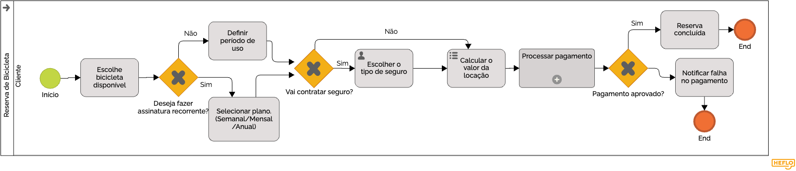

### 3.3.2 Processo 2 – Reserva de Bicicleta

O processo pode ser aprimorado com a implementação de filtros mais avançados na busca de bicicletas, como localização, tipo e preço.

#### Detalhamento das atividades

_Descreva aqui cada uma das propriedades das atividades do processo 2. Devem estar relacionadas com o modelo de processo apresentado anteriormente._

**Acessar catálogo**

| **Campo** | **Tipo** | **Restrições** | **Valor default** |
| --- | --- | --- | --- |
| Tipo de bicicleta | Seleção única | Opções disponíveis | |
| Preço máximo | Número | Valor positivo, Opcional | |

| **Comandos** | **Destino** | **Tipo** |
| --- | --- | --- |
| Buscar | Consultar modelos disponíveis | default |

**Consultar modelos disponíveis**
*(Atividade de serviço/sistema: não possui interface, apenas regras de busca no banco de dados)*

| **Regras (Sistema)** |
| --- |
| Buscar no banco de dados as bicicletas que correspondem aos filtros aplicados. |
| Retornar apenas as bicicletas que possuam o status de "Disponível". |

| **Comandos (Retorno do Sistema)** | **Destino** | **Tipo** |
| --- | --- | --- |
| Exibir resultados | Selecionar bicicleta | default |

**Selecionar bicicleta**

| **Campo** | **Tipo** | **Restrições** | **Valor default** |
| --- | --- | --- | --- |
| Lista de bicicletas | Tabela | Dados retornados pelo sistema | |
| Bicicleta escolhida | Seleção única | Obrigatório | |

| **Comandos** | **Destino** | **Tipo** |
| --- | --- | --- |
| Continuar / Escolher | Definir período | default |

**Definir período**

| **Campo** | **Tipo** | **Restrições** | **Valor default** |
| --- | --- | --- | --- |
| Data início | Data e Hora | Obrigatório, deve ser maior ou igual à data atual | |
| Data fim | Data e Hora | Obrigatório, deve ser maior que a Data início | |

| **Comandos** | **Destino** | **Tipo** |
| --- | --- | --- |
| Confirmar período | Escolher tipo de seguro | default |
| Voltar | Selecionar bicicleta | cancel |

**Escolher tipo de seguro**

| **Campo** | **Tipo** | **Restrições** | **Valor default** |
| --- | --- | --- | --- |
| Tipo de seguro | Seleção única | Obrigatório (Básico, Intermediário, Premium) | Básico |

| **Comandos** | **Destino** | **Tipo** |
| --- | --- | --- |
| Confirmar seguro | Calcular valor da locação | default |
| Voltar | Definir período | cancel |

**Calcular valor da locação**
*(Atividade de serviço/sistema: cálculo realizado em back-end)*

| **Regras (Sistema)** |
| --- |
| Calcular a duração total da locação com base nas datas de início e fim. |
| Multiplicar a duração pelo valor da tarifa da bicicleta escolhida. |
| Adicionar ao montante o valor referente ao tipo de seguro selecionado. |

| **Comandos (Retorno do Sistema)** | **Destino** | **Tipo** |
| --- | --- | --- |
| Cálculo concluído | Registrar reserva (Pendente Pgto) | default |

**Registrar reserva (Pendente Pgto)**
*(Atividade de serviço/sistema: gravação dos dados no banco e alteração de status)*

| **Regras (Sistema)** |
| --- |
| Gerar um código único para a reserva. |
| Gravar os dados da reserva no banco de dados vinculados ao cliente logado. |
| Definir o status da reserva como "Pendente de Pagamento". |
| Bloquear temporariamente a bicicleta selecionada para o período definido. |

| **Comandos (Retorno do Sistema)** | **Destino** | **Tipo** |
| --- | --- | --- |
| Finalizar | FIM | default |
