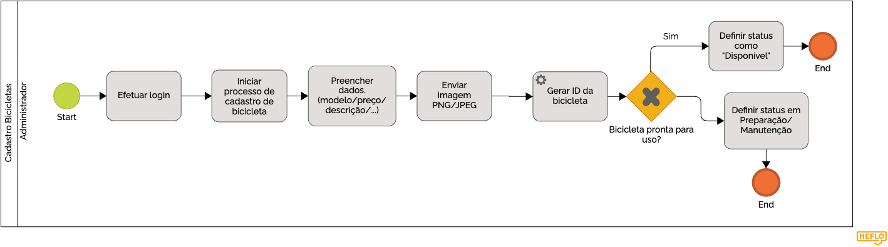
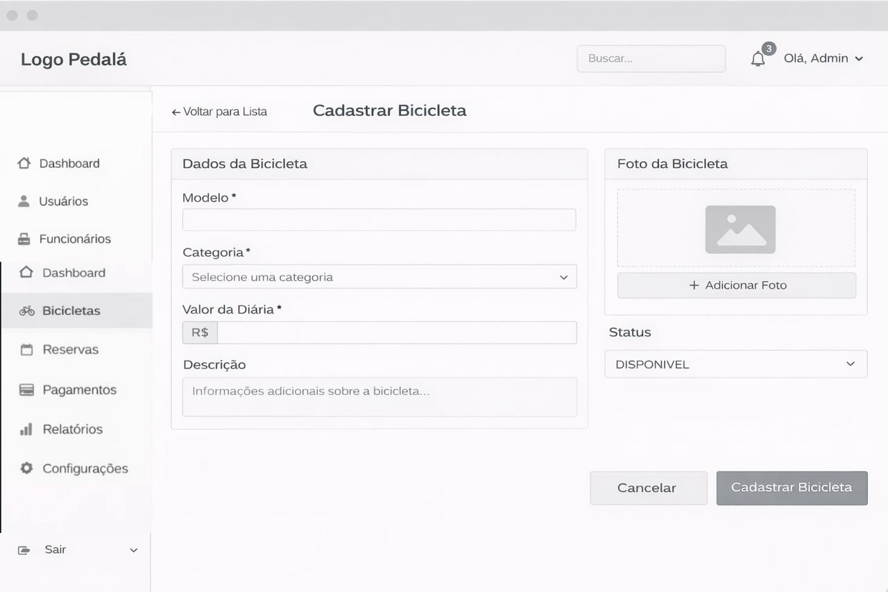

### 3.3.3 Processo 2 – Cadastro de Bicicletas

O processo tem como objetivo permitir que o administrador cadastre novas bicicletas no sistema, garantindo que estejam prontas para locação. Uma oportunidade de melhoria futura seria a inclusão de integração com uma API de fabricantes para preenchimento automático das especificações técnicas com base no modelo, reduzindo o tempo de digitação do administrador.

#### Detalhamento das atividades

_Descreva aqui cada uma das propriedades das atividades do processo. Devem estar relacionadas com o modelo de processo apresentado anteriormente._

**Acessar painel administrativo**

| **Campo** | **Tipo** | **Restrições** | **Valor default** |
| --- | --- | --- | --- |
| Email | Caixa de texto | Obrigatório, formato válido de e-mail | |
| Senha | Caixa de texto | Obrigatório, mínimo de 8 caracteres | |

| **Comandos** | **Destino** | **Tipo** |
| --- | --- | --- |
| entrar | Clicar na opção cadastrar bicicleta | default |

**Clicar na opção cadastrar bicicleta**
*(Navegação no dashboard do administrador)*

| **Campo** | **Tipo** | **Restrições** | **Valor default** |
| --- | --- | --- | --- |
| N/A | N/A | | |

| **Comandos** | **Destino** | **Tipo** |
| --- | --- | --- |
| cadastrar bicicleta | Preencher dados da bicicleta | link/botão |

**Preencher dados da bicicleta**

| **Campo** | **Tipo** | **Restrições** | **Valor default** |
| --- | --- | --- | --- |
| Modelo | Caixa de texto | Obrigatório | |
| Categoria | Seleção única | Obrigatório (Urbana / Esportiva / Elétrica) | |
| Valor da diária | Número | Obrigatório, maior que zero (> 0) | |
| Descrição | Área de texto | Opcional | |
| Localização | Caixa de texto | Obrigatório | |
| Imagem | Imagem | Opcional | |

| **Comandos** | **Destino** | **Tipo** |
| --- | --- | --- |
| salvar | Validar informações | default |
| cancelar | End | cancel |

**Validar informações**
*(Atividade de serviço/sistema: não possui interface de usuário)*

| **Regras (Sistema)** |
| --- |
| Verificar se todos os campos obrigatórios foram preenchidos. |
| Validar se o "Valor da diária" é um número positivo válido. |
| Verificar integridade do formato da imagem enviada (se houver). |

| **Comandos (Retorno do Sistema)** | **Destino** | **Tipo** |
| --- | --- | --- |
| Sim (Dados Válidos) | Definir Status como Disponível | default |
| Não (Dados Inválidos) | Preencher dados da bicicleta | cancel |

**Definir Status como Disponível**
*(Atividade de serviço/sistema: gravação no banco de dados e atualização de status)*

| **Regras (Sistema)** |
| --- |
| Gerar ID único para a nova bicicleta. |
| Registrar data e hora do cadastro automaticamente. |
| Salvar todos os dados da bicicleta no banco de dados do sistema. |
| Definir o atributo "status" da bicicleta obrigatoriamente como "Disponível". |

| **Comandos (Retorno do Sistema)** | **Destino** | **Tipo** |
| --- | --- | --- |
| concluir | End | default |
