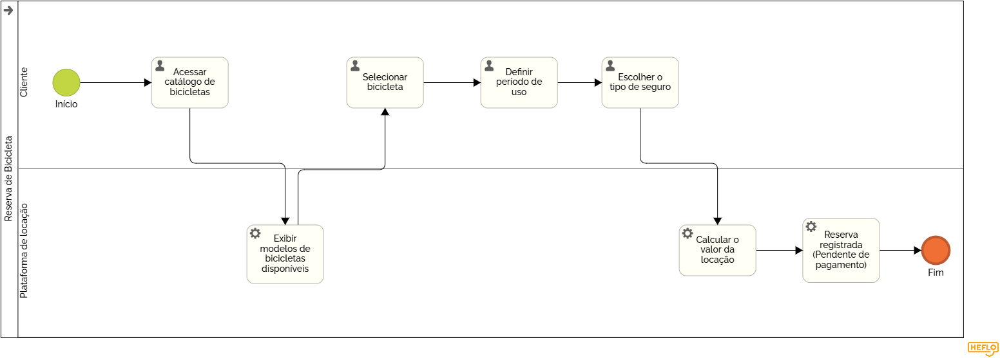

### 3.3.2 Processo 2 – RESERVA DE BICICLETA

O processo pode ser aprimorado com a implementação de filtros mais avançados na busca de bicicletas, como localização, tipo e preço.

#### Detalhamento das atividades

_Descreva aqui cada uma das propriedades das atividades do processo 2. 
Devem estar relacionadas com o modelo de processo apresentado anteriormente._

_Os tipos de dados a serem utilizados são:_

_* **Área de texto** - campo texto de múltiplas linhas_

_* **Caixa de texto** - campo texto de uma linha_

_* **Número** - campo numérico_

_* **Data** - campo do tipo data (dd-mm-aaaa)_

_* **Hora** - campo do tipo hora (hh:mm:ss)_

_* **Data e Hora** - campo do tipo data e hora (dd-mm-aaaa, hh:mm:ss)_

_* **Imagem** - campo contendo uma imagem_

_* **Seleção única** - campo com várias opções de valores que são mutuamente exclusivas (tradicional radio button ou combobox)_

_* **Seleção múltipla** - campo com várias opções que podem ser selecionadas mutuamente (tradicional checkbox ou listbox)_

_* **Arquivo** - campo de upload de documento_

_* **Link** - campo que armazena uma URL_

_* **Tabela** - campo formado por uma matriz de valores_

**Acessar catálogo de bicicletas**

| **Campo**       | **Tipo**         | **Restrições** | **Valor default** |
| ---             | ---              | ---            | ---               |
| Localização     | Caixa de texto   |  opcional      |                   |
|tipo de bicicleta| Seleção única    |opções disponíveis|                   |
| preço máximo    | Número           |valor positivo |                   |
|                 |                  |                |                   |

| **Comandos**         |  **Destino**                   | **Tipo** |
| ---                  | ---                            | ---               |
| buscar               | Exibir bicicletas disponiveis  | default           |
|                      |                                |                   |

**Exibir bicicletas disponíveis**

| **Campo**       | **Tipo**         | **Restrições** | **Valor default** |
| ---             | ---              | ---            | ---               |
| Lista de bicicletas| tabela        | dados do sistema|                   |
|imagem da bicicleta | imagem        | opcional       |                   |
|                 |                  |                |                   |

| **Comandos**         |  **Destino**                   | **Tipo**          |
| ---                  | ---                            | ---               |
| selecionar bicicleta | Selecionar bicicleta           | default           |
|                      |                                |                   |

**Selecionar bicicleta**

| **Campo**       | **Tipo**         | **Restrições** | **Valor default** |
| ---             | ---              | ---            | ---               |
| bicicleta escolhida | Caixa de texto  | obrigatório |                   |
|                 |                  |                |                   |

| **Comandos**         |  **Destino**                   | **Tipo**          |
| ---                  | ---                            | ---               |
| continuar            | definir período                | default           |
|                      |                                |                   |

**Definir período de locação**

| **Campo**       | **Tipo**         | **Restrições** | **Valor default** |
| ---             | ---              | ---            | ---               |
| data início     |data              |   obrigatório  |                   |
| data fim        | data             |  maior que data fim|                   |
|                 |                  |                |                   |

| **Comandos**         |  **Destino**                   | **Tipo**          |
| ---                  | ---                            | ---               |
| confirmar período    | escolher seguro                | default           |
|                      |                                |                   |

**Escolher tipo de seguro**

| **Campo**       | **Tipo**         | **Restrições** | **Valor default** |
| ---             | ---              | ---            | ---               |
| tipo de seguro  | seleção única  |Básico, intermediário, premium|Básico  |
|                 |                  |                |                   |

| **Comandos**         |  **Destino**                   | **Tipo**          |
| ---                  | ---                            | ---               |
| confirmar seguro     | calcular valor total           | default           |
|                      |                                |                   |

**Calcular valor total**

| **Campo**       | **Tipo**         | **Restrições** | **Valor default** |
| ---             | ---              | ---            | ---               |
| valor da locação | número          | calculado automaticamente | automático|
|                 |                  |                |                   |

| **Comandos**         |  **Destino**                   | **Tipo**          |
| ---                  | ---                            | ---               |
| continuar            |     registrar reserva          | default           |
|                      |                                |                   |

**Registrar reserva**

| **Campo**       | **Tipo**         | **Restrições** | **Valor default** |
| ---             | ---              | ---            | ---               |
| status da reserva| caixa de texto  | pendente de pagamento|Pendente     |
| código da reserva| número          | gerado automaticamente|automático  |
|                 |                  |                |                   |

| **Comandos**         |  **Destino**                   | **Tipo**          |
| ---                  | ---                            | ---               |
| finalizar            | fim do processo                |default            |
|                      |                                |                   |
