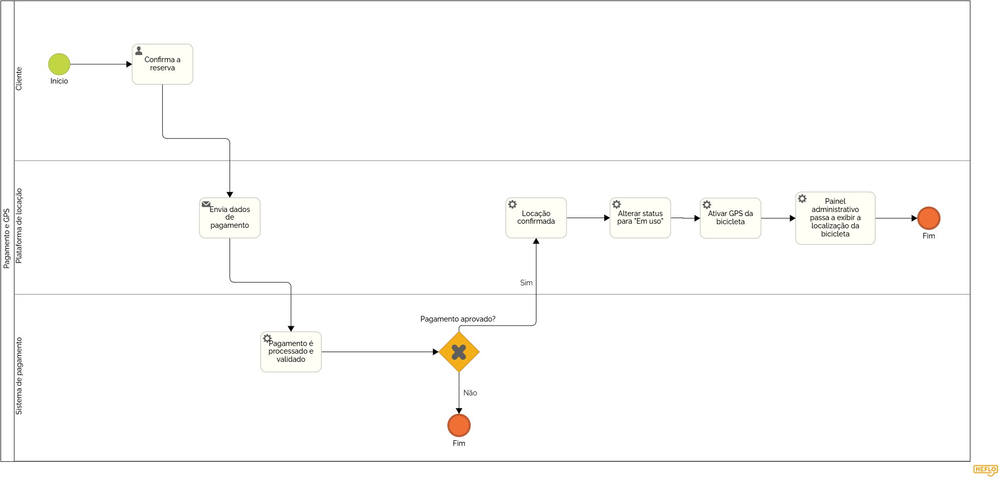

### 3.3.3 Processo 3 – Pagamento e GPS

O processo pode ser aprimorado com a inclusão de múltiplas formas de pagamento, como PIX, cartão de crédito e carteiras digitais. Outra melhoria seria a implementação de notificações em tempo real para informar o status do pagamento ao cliente.

#### Detalhamento das atividades

_Descreva aqui cada uma das propriedades das atividades do processo 3. 
Devem estar relacionadas com o modelo de processo apresentado anteriormente._

_Os tipos de dados a serem utilizados são:_

_* **Área de texto** - campo texto de múltiplas linhas_

_* **Caixa de texto** - campo texto de uma linha_

_* **Número** - campo numérico_

_* **Data** - campo do tipo data (dd-mm-aaaa)_

_* **Hora** - campo do tipo hora (hh:mm:ss)_

_* **Data e Hora** - campo do tipo data e hora (dd-mm-aaaa, hh:mm:ss)_

_* **Imagem** - campo contendo uma imagem_

_* **Seleção única** - campo com várias opções de valores que são mutuamente exclusivas (tradicional radio button ou combobox)_

_* **Seleção múltipla** - campo com várias opções que podem ser selecionadas mutuamente (tradicional checkbox ou listbox)_

_* **Arquivo** - campo de upload de documento_

_* **Link** - campo que armazena uma URL_

_* **Tabela** - campo formado por uma matriz de valores_

**Confirmar reserva**

| **Campo**       | **Tipo**         | **Restrições** | **Valor default** |
| ---             | ---              | ---            | ---               |
| código da reserva| número         | obrigatório    |                   |
| valor total     | número          | somente leitura |                   |
|  |                  |                |                   |

| **Comandos**         |  **Destino**                   | **Tipo** |
| ---                  | ---                            | ---               |
| confirmar            | Enviar dados para pagamento    | default           |
| cancelar             | fim do processo                | cancel            |
|       |                                |                   |

**Enviar dados para pagamento**

| **Campo**       | **Tipo**         | **Restrições** | **Valor default** |
| ---             | ---              | ---            | ---               |
| dados do pagamento | área de texto  | obrigatório   |                   |
|                 |                  |                |                   |

| **Comandos**         |  **Destino**                   | **Tipo**          |
| ---                  | ---                            | ---               |
| enviar               | processar pagamento            | default           |
|                      |                                |                   |

**Processar pagamento**

| **Campo**       | **Tipo**         | **Restrições** | **Valor default** |
| ---             | ---              | ---            | ---               |
|status do pagamento |caixa de texto  | aprovado ou recusado               |                   |
|                 |                  |                |                   |

| **Comandos**         |  **Destino**                   | **Tipo**          |
| ---                  | ---                            | ---               |
| aprovado | confirmar locação  |default |
| recusado | fim do processo | cancel |
|                      |                                |                   |

**Confirmar locação**

| **Campo**       | **Tipo**         | **Restrições** | **Valor default** |
| ---             | ---              | ---            | ---               |
| Status da locação | caixa de texto  |confirmado                | confirmado                  |
|                 |                  |                |                   |

| **Comandos**         |  **Destino**                   | **Tipo**          |
| ---                  | ---                            | ---               |
| continuar | Atualizar status da bicicleta  | default |
|                      |                                |                   |

**Atualizar status da bicicleta**

| **Campo**       | **Tipo**         | **Restrições** | **Valor default** |
| ---             | ---              | ---            | ---               |
| status da bicicleta |caixa de texto  |Em uso                |   Em uso                |
|                 |                  |                |                   |

| **Comandos**         |  **Destino**                   | **Tipo**          |
| ---                  | ---                            | ---               |
| atualizar | ativar GPS | default |
|                      |                                |                   |

**Ativar GPS**

| **Campo**       | **Tipo**         | **Restrições** | **Valor default** |
| ---             | ---              | ---            | ---               |
| Status do GPS | Caixa de texto  | ativo               | ativo                  |
|                 |                  |                |                   |

| **Comandos**         |  **Destino**                   | **Tipo**          |
| ---                  | ---                            | ---               |
| ativar | exibir localização no painel  | default |
|                      |                                |                   |

**Exibir localização no painel**

| **Campo**       | **Tipo**         | **Restrições** | **Valor default** |
| ---             | ---              | ---            | ---               |
| localização em tempo real | área de texto  | localização contínua                |                   |
|                 |                  |                |                   |

| **Comandos**         |  **Destino**                   | **Tipo**          |
| ---                  | ---                            | ---               |
| finalizar | fim do processo | default |
|                      |                                |                   |

