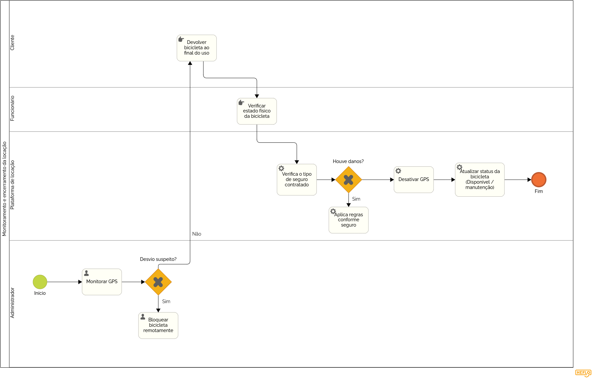

### 3.3.4 Processo 4 – MONITORAMENTO E ENCERRAMENTO DA LOCAÇÃO

A criação de um histórico detalhado de uso pode ajudar na tomada de decisões administrativas. Também é possível melhorar a comunicação com o cliente por meio de notificações durante todo o período de locação.

#### Detalhamento das atividades

_Descreva aqui cada uma das propriedades das atividades do processo 4. 
Devem estar relacionadas com o modelo de processo apresentado anteriormente._

_Os tipos de dados a serem utilizados são:_

_* **Área de texto** - campo texto de múltiplas linhas_

_* **Caixa de texto** - campo texto de uma linha_

_* **Número** - campo numérico_

_* **Data** - campo do tipo data (dd-mm-aaaa)_

_* **Hora** - campo do tipo hora (hh:mm:ss)_

_* **Data e Hora** - campo do tipo data e hora (dd-mm-aaaa, hh:mm:ss)_

_* **Imagem** - campo contendo uma imagem_

_* **Seleção única** - campo com várias opções de valores que são mutuamente exclusivas (tradicional radio button ou combobox)_

_* **Seleção múltipla** - campo com várias opções que podem ser selecionadas mutuamente (tradicional checkbox ou listbox)_

_* **Arquivo** - campo de upload de documento_

_* **Link** - campo que armazena uma URL_

_* **Tabela** - campo formado por uma matriz de valores_

**Monitorar localização das bicicletas**

| **Campo**       | **Tipo**         | **Restrições** | **Valor default** |
| ---             | ---              | ---            | ---               |
| localização em tempo real | área de texto  |  atualização contínua|                   |
| status da bicicleta| caixa de texto  |obrigatório                |Em uso                   |
| |                  |                |                   |

| **Comandos**         |  **Destino**                   | **Tipo** |
| ---                  | ---                            | ---               |
| verificar situação | verificar desvio suspeito  | default |
|       |                                |                   |

**Verificar desvio suspeito**

| **Campo**       | **Tipo**         | **Restrições** | **Valor default** |
| ---             | ---              | ---            | ---               |
| status de rota | caixa de texto  | dentro ou fora da rota               |                   |
|                 |                  |                |                   |

| **Comandos**         |  **Destino**                   | **Tipo**          |
| ---                  | ---                            | ---               |
| desvio detectado | bloquear bicicleta  | default |
| sem desvio | devolver bicicleta  |  |
|                      |                                |                   |

**Bloquear bicicleta**

| **Campo**       | **Tipo**         | **Restrições** | **Valor default** |
| ---             | ---              | ---            | ---               |
| status do bloqueio | caixa de texto  | ativado               | ativado                  |
|                 |                  |                |                   |

| **Comandos**         |  **Destino**                   | **Tipo**          |
| ---                  | ---                            | ---               |
| continuar | devolver bicicleta  | default |
|                      |                                |                   |

**Devolver bicicleta**

| **Campo**       | **Tipo**         | **Restrições** | **Valor default** |
| ---             | ---              | ---            | ---               |
| data de devolução | data e hora  | obrigatório               |                   |
| condição da bicicleta | área de texto  | preenchido pelo funcionário               |                   |
|                 |                  |                |                   |

| **Comandos**         |  **Destino**                   | **Tipo**          |
| ---                  | ---                            | ---               |
| confirmar devolução | verificar estado físico da bicicleta  | default |
|                      |                                |                   |

**Verificar estado físico da bicicleta**

| **Campo**       | **Tipo**         | **Restrições** | **Valor default** |
| ---             | ---              | ---            | ---               |
| estado físico | área de texto  |obrigatório               |                   |
| danos identificados | área de texto  | opcional              |                   |
|                 |                  |                |                   |

| **Comandos**         |  **Destino**                   | **Tipo**          |
| ---                  | ---                            | ---               |
| sem danos | Desativar GPS  | default |
| com danos | Acionar seguro  |  |
|                      |                                |                   |

**Verificar seguro**

| **Campo**       | **Tipo**         | **Restrições** | **Valor default** |
| ---             | ---              | ---            | ---               |
| tipo de seguro | seleção úncia | Básico, Intermediário, Premium               |                   |
|                 |                  |                |                   |

| **Comandos**         |  **Destino**                   | **Tipo**          |
| ---                  | ---                            | ---               |
| Aplicar regras | Aplicar regras do seguro | default|
|                      |                                |                   |

**Aplicar regras do seguro**

| **Campo**       | **Tipo**         | **Restrições** | **Valor default** |
| ---             | ---              | ---            | ---               |
| valor do dano| número  | valor positivo              |                   |
| cobertura aplicada | caixa de texto  | conforme plano              |                   |
|                 |                  |                |                   |

| **Comandos**         |  **Destino**                   | **Tipo**          |
| ---                  | ---                            | ---               |
| continuar | Desativar GPS  | default |
|                      |                                |                   |

**Desativar GPS**

| **Campo**       | **Tipo**         | **Restrições** | **Valor default** |
| ---             | ---              | ---            | ---               |
| status do GPS | caixa de texto  | inativo              |  inativo                 |
|                 |                  |                |                   |

| **Comandos**         |  **Destino**                   | **Tipo**          |
| ---                  | ---                            | ---               |
| continuar | Atualizar status da bicicleta  | default |
|                      |                                |                   |

**Atualizar status da bicicleta**

| **Campo**       | **Tipo**         | **Restrições** | **Valor default** |
| ---             | ---              | ---            | ---               |
| status da bicicleta | caixa de texto  | disponível ou manutenção             |  Disponível                 |

| **Comandos**         |  **Destino**                   | **Tipo**          |
| ---                  | ---                            | ---               |
| finalizar | fim do processo  | default |
|                      |                                |                   |

