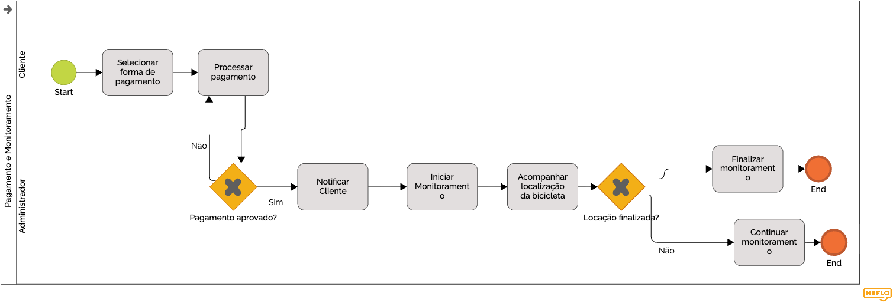
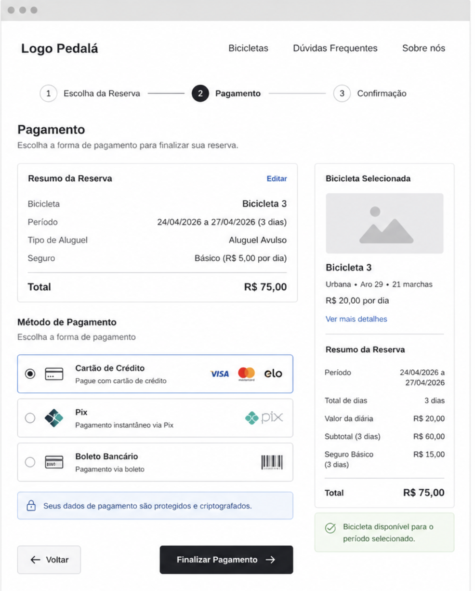

### 3.3.3 Processo 4 – Pagamento e Monitoramento da Locação (GPS)

O processo de pagamento pode ser aprimorado com a inclusão de múltiplas formas de pagamento, como PIX, cartão de crédito e carteiras digitais. Além disso, a implementação de notificações em tempo real permite informar o cliente sobre o status da transação, tornando a experiência mais transparente e eficiente. Após a confirmação do pagamento, inicia-se o monitoramento da bicicleta durante o período da locação.

#### Detalhamento das atividades

---

### **Selecionar forma de pagamento**

| **Campo**             | **Tipo**         | **Restrições**                  | **Valor default** |
|----------------------|------------------|---------------------------------|-------------------|
| forma de pagamento   | Seleção única    | PIX / Cartão / Carteira digital |                   |

| **Comandos** | **Destino**           | **Tipo** |
|--------------|----------------------|----------|
| confirmar    | Processar pagamento  | default  |

---

### **Processar pagamento**

| **Campo** | **Tipo** | **Restrições** | **Valor default** |
|----------|----------|----------------|-------------------|
| valor    | Número   | maior que 0    |                   |

| **Comandos** | **Destino**             | **Tipo** |
|--------------|------------------------|----------|
| processar    | Verificar pagamento    | default  |

---

### **Verificar pagamento**

| **Campo** | **Tipo**        | **Restrições**           | **Valor default** |
|----------|------------------|--------------------------|-------------------|
| status   | Seleção única    | aprovado / recusado      |                   |

| **Comandos** | **Destino**                    | **Tipo** |
|--------------|--------------------------------|----------|
| aprovado     | Confirmar pagamento            | default  |
| recusado     | Notificar falha no pagamento   | cancel   |

---

### **Notificar falha no pagamento**

| **Campo** | **Tipo**        | **Restrições** | **Valor default** |
|----------|------------------|----------------|-------------------|
| mensagem | Área de texto    | obrigatório    |                   |

| **Comandos**        | **Destino**                 | **Tipo** |
|---------------------|----------------------------|----------|
| tentar novamente    | Selecionar forma de pagamento | default  |

---

### **Confirmar pagamento**

| **Campo** | **Tipo**        | **Restrições** | **Valor default** |
|----------|------------------|----------------|-------------------|
| status   | Seleção única    | pago           |                   |

| **Comandos** | **Destino**          | **Tipo** |
|--------------|---------------------|----------|
| continuar    | Notificar cliente   | default  |

---

### **Notificar cliente**

| **Campo** | **Tipo**        | **Restrições** | **Valor default** |
|----------|------------------|----------------|-------------------|
| mensagem | Área de texto    | obrigatório    |                   |

| **Comandos** | **Destino**                      | **Tipo** |
|--------------|----------------------------------|----------|
| enviar       | Consultar localização da bicicleta | default  |

---

### **Consultar localização da bicicleta**

| **Campo**        | **Tipo**        | **Restrições** | **Valor default** |
|-----------------|------------------|----------------|-------------------|
| localização     | Caixa de texto   | automático     |                   |
| status locação  | Seleção única    | em uso         |                   |

| **Comandos** | **Destino**                  | **Tipo** |
|--------------|-----------------------------|----------|
| atualizar    | Verificar finalização       | default  |

---

### **Verificar finalização da locação**

| **Campo** | **Tipo**        | **Restrições**           | **Valor default** |
|----------|------------------|--------------------------|-------------------|
| status   | Seleção única    | em andamento / finalizada|                   |

| **Comandos** | **Destino**                         | **Tipo** |
|--------------|-------------------------------------|----------|
| finalizada   | Encerrar monitoramento              | default  |
| em andamento | Consultar localização da bicicleta  | default  |

---

### **Encerrar monitoramento**

| **Campo**       | **Tipo**        | **Restrições** | **Valor default** |
|----------------|------------------|----------------|-------------------|
| data/hora fim  | Data e hora      | automático     | atual             |

| **Comandos** | **Destino** | **Tipo** |
|--------------|------------|----------|
| finalizar    | Fim        | default  |
