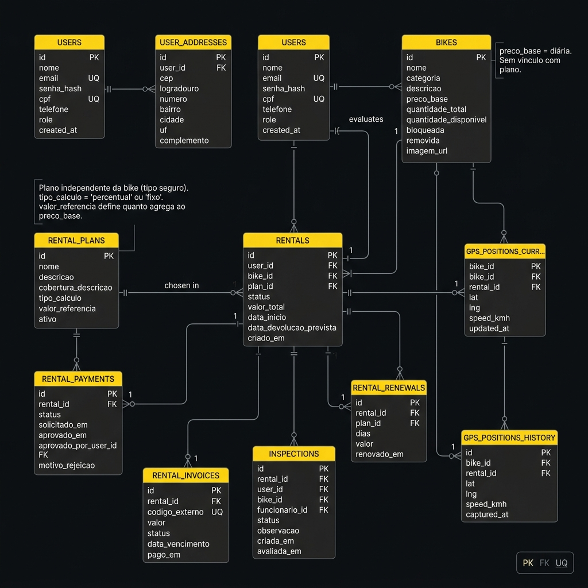

## 4. Projeto da Solução

### 4.1. Modelo de Dados

O modelo relacional abaixo contempla todas as entidades e atributos na modelagem dos processos de negócio do **Pedala** — plataforma de aluguel de bicicletas. .



#### Descrição das Entidades

| Entidade | Descrição |
|---|---|
| `USERS` | Usuários do sistema (clientes, funcionários e administradores). O campo `role` diferencia os níveis de acesso (`customer`, `employee`, `admin`). |
| `USER_ADDRESSES` | Endereço associado a cada usuário (1:1). Armazena CEP, logradouro, bairro, cidade e UF. |
| `BIKES` | Catálogo de bicicletas. Possui `preco_base` (diária da bike, independente de plano), quantidade total e disponível, além de flags de bloqueio e remoção. **Não possui vínculo direto com planos de proteção.** |
| `RENTAL_PLANS` | **Planos de proteção/seguro**, independentes da bicicleta — análogo aos planos da Localiza (ex: Básico, Intermediário, Premium). Cada plano define uma `cobertura_descricao` (o que cobre) e uma `tipo_calculo` (`percentual` ou `fixo`) com um `valor_referencia` que define quanto agrega ao `preco_base` da bike no cálculo do `valor_total` da locação. |
| `RENTALS` | Registro central de cada locação. Referencia `bike_id` (a bike alugada) **e** `plan_id` (o plano de proteção escolhido). O `valor_total` é calculado a partir do `preco_base` da bike + a regra de acréscimo do plano. |
| `RENTAL_PAYMENTS` | Controle de aprovação do pagamento de cada locação. O campo `aprovado_por_user_id` rastreia o funcionário que autorizou. |
| `RENTAL_INVOICES` | Faturas geradas por locação (podendo ser recorrentes). Guarda código externo de cobrança, valor, status e data de vencimento. |
| `RENTAL_RENEWALS` | Histórico de renovações. Cada renovação referencia também o `plan_id` (o cliente pode trocar de plano na renovação). |
| `INSPECTIONS` | Vistorias realizadas na bicicleta antes e após a locação. Registra o funcionário responsável, status (pendente, aprovado, reprovado) e observações. |
| `GPS_POSITIONS_CURRENT` | Posição GPS atual de cada bicicleta (atualização em tempo real). Chave primária é `bike_id`. |
| `GPS_POSITIONS_HISTORY` | Histórico de posições GPS geradas durante uma locação (trilha completa). |

#### Relacionamentos principais

```
USERS           1:1   USER_ADDRESSES
USERS           1:N   RENTALS
USERS           1:N   INSPECTIONS          (como avaliador)
USERS           1:N   RENTAL_PAYMENTS      (como aprovador)
BIKES           1:N   RENTALS
BIKES           1:1   GPS_POSITIONS_CURRENT
BIKES           1:N   GPS_POSITIONS_HISTORY
BIKES           1:N   INSPECTIONS
RENTAL_PLANS    1:N   RENTALS              (plano escolhido na locação)
RENTAL_PLANS    1:N   RENTAL_RENEWALS      (plano pode ser trocado na renovação)
RENTALS         1:1   RENTAL_PAYMENTS
RENTALS         1:N   RENTAL_INVOICES
RENTALS         1:N   RENTAL_RENEWALS
RENTALS         1:N   INSPECTIONS
RENTALS         1:N   GPS_POSITIONS_HISTORY
```

### 4.2. Tecnologias

A stack foi escolhida com foco em **agilidade de desenvolvimento**, **baixo custo de infraestrutura** e **aderência ao escopo acadêmico** do projeto, sem abrir mão de boas práticas de engenharia de software.

| **Dimensão**         | **Tecnologia**                              | **Justificativa** |
|---|---|---|
| **SGBD**             | MySQL                                       | Banco relacional robusto, amplamente utilizado no mercado e suportado nativamente pela maioria dos provedores de hospedagem gratuitos. |
| **Front-end**        | HTML + CSS + JavaScript (Vanilla)           | Sem frameworks de build, garantindo portabilidade e compatibilidade com GitHub Pages. Design system próprio baseado em design tokens (cores, tipografia, espaçamentos). |
| **Back-end**         | Java Spring Boot                        | Runtime JavaScript leve e não bloqueante, ideal para APIs REST. Framework Express minimiza boilerplate mantendo flexibilidade. |
| **GPS / Tempo real** | Simulador GPS em Node.js (WebSocket-ready)  | Simula posições de bicicletas em movimento para demonstração do rastreamento em tempo real. |

| **Testes**           | Postman                                     | Validação dos endpoints da API durante o desenvolvimento. |


